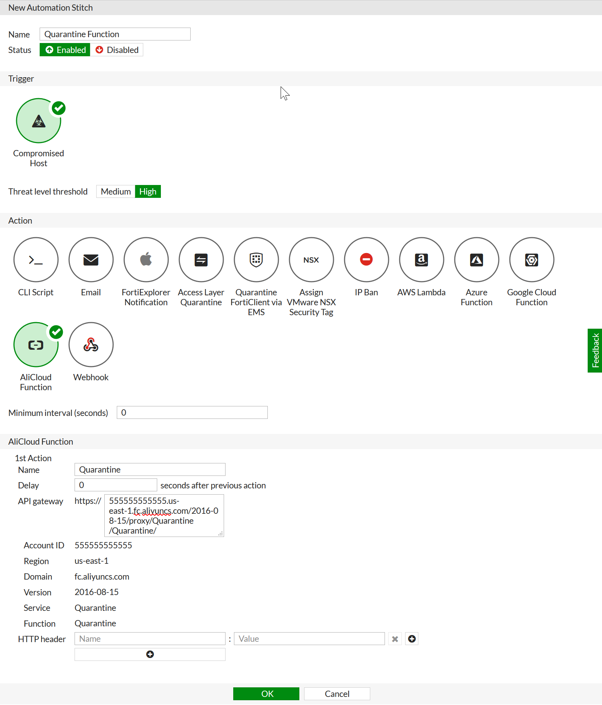

# Introduction
This AliCloud Function works with a Fortigate Automation Action to change the security group of a requested ECS instance to one specified in an environment variable. This function uses Node.js 8 and works by first describing and filtering the instances in the specified Region by IP address, and then attaching the pre-defined Security Group to that instance.

# Set up the AliCloud function

This function requires a RAM user to be setup with an AccessKey and Secret. For details on creating a RAM user, refer to the AliCloud article [Create a RAM user](https://www.alibabacloud.com/help/doc-detail/28637.htm?spm=a2c63.p38356.b99.13.378647c9NkDOum).

  1. In the Ali Console, under **Elastic Computing**, select **Function Compute**.
  2. Select a region (top left). It is recommended that you set up the service in the same region as your ECS instances.
  3. Click **Create Service**.
  4. Enter a **Service Name** and click **OK**.
  5. In the new service, click **Create Function**.
  6. Under **Function Template**, select **Empty Function**.
  7. Under **Configure Triggers**, select **HTTP Trigger**.
  8. Enter a **Trigger Name** and set the **Authorization** (**Function** is recommended).
  9. Under **Method**, select **POST**.
  10. Under **Configure Function Settings**, enter a **Function Name**.
  11. Set the **Runtime** to **Nodejs8**.
  12. Set the following **Environment Variables**:
      * **REGION_ID:** The region your ECS instances are in.
      * **SECURITY_GROUP_ID:** The Security Group you will add to your Instances.
      * **ACCESS_KEY_ID:** The AccessKey set up with the RAM user.
      * **ACCESS_KEY_SECRET:** The Secret associated with the AccessKey.
      * **ENDPOINT:** The endpoint associated with your region (Mappings can be found [here](https://www.alibabacloud.com/help/doc-detail/31837.htm)).
  13. Set **Permissions** for the function. At minimum, **Read** and **Write** to ECS are required.
  14. Under the **Code** tab, copy the provided `index.js` code into the editor and click **Save**.

The link to your HTTP Trigger will be displayed below the editor. You will use this in the next section.

# Set up the FortiGate

  1. Log into your FortiGate.
  2. Select **Security Fabric > Automation**.
  3. Click **Create New**.
  4. Enter a **Name**.
  5. Under **Trigger**, select **Compromised Host**.
  6. Under **Action**, select **AliCloud Function**.
  7. Under **AliCloud Function**, set the parameters, with the **HTTP URL** and the settings generated in the previous section.

  An example is shown below.

  

# Support
Fortinet-provided scripts in this and other GitHub projects do not fall under the regular Fortinet technical support scope and are not supported by FortiCare Support Services.
For direct issues, please refer to the [Issues](https://github.com/fortinet/alicloud-security-group-update/issues) tab of this GitHub project.
For other questions related to this project, contact [github@fortinet.com](mailto:github@fortinet.com).

## License
[License](./LICENSE) © Fortinet Technologies. All rights reserved.
